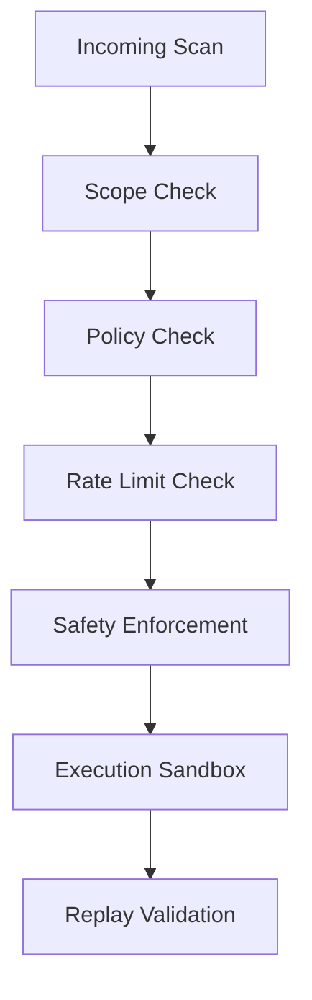
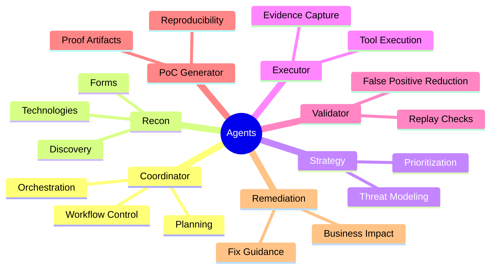
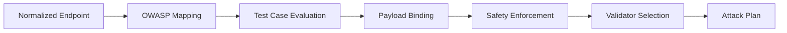

# RakshAI Backend Client Presentation

## Slide 1 - Title
RakshAI Backend Architecture

A multi-agent, rule-driven, LLM-assisted security testing platform.

---

## Slide 2 - High-Level Flow

```mermaid
flowchart LR
    A[Client Request] --> B[API Layer]
    B --> C[Orchestrator]
    C --> D[Coordinator Agent]
    D --> E[Recon Agent]
    E --> F[Rule Engine]
    F --> G[Attack Plan]
    G --> H[Executor Agent]
    H --> I[Validator Agent]
    I --> J[PoC + Remediation]
    J --> K[Report Generator]
    K --> L[Storage + Download]
```

---

## Slide 3 - Security Controls

Key protections:
- Out-of-scope targets are blocked
- Unsafe attack patterns are filtered
- Payloads are constrained by policy
- Findings are validated before acceptance

---

## Slide 4 - Agent Roles

---

## Slide 5 - Test Case Selection

How it works:
- Endpoint behavior is normalized
- OWASP categories are assigned
- Matching test cases are selected from the knowledge base
- Payloads are attached to each test
- Unsafe actions are removed
- Validators are linked to the test plan

---

## Slide 6 - LLM Usage

The LLM is used for reasoning and communication, not direct execution.

Used for:
- Strategy generation
- Threat analysis
- Executive summaries
- Remediation text
- Report narration

Controlled by:
- Deterministic rule engine
- Replay validation
- Policy enforcement
- Knowledge base context

---

## Slide 7 - Report Output

The backend generates multiple deliverables:
- PDF report
- Word report
- Excel workbook
- JSON fallback output

These are stored and made available for download through the report endpoints.

---

## Slide 8 - Client Message

RakshAI automates the security testing lifecycle while keeping control, safety, and traceability at the center of the workflow.

It reduces manual testing time, improves consistency, and gives technical and non-technical stakeholders clear, downloadable reporting.
